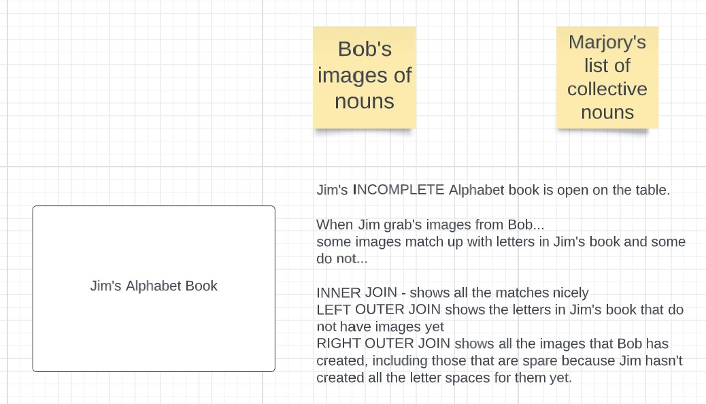

# Jimbob
A database story that I created to help me to learn joins. The story has 3 characters trying to create a children's alphabet picture book.

Jim is the author of the alphabet book.
Bob is the illustrator of the alphabet book.
Marjory is an overachiever who is looking at collective nouns for groups of animals.

Together they have a database that they are using to create a book.

## Alphabet Book


## INNER JOIN Jim's open book on the table with Bob's pictures inserted
```bash
select 
	jim.letter as "Letters in Book",
    bob.noun as "Pictures"
from jim
inner join bob
on bob.noun_id = jim.noun_id
order by jim.letter;
```

## LEFT JOIN Jim's open book on the table with Bob's pictures inserted
### but showing all the letter spaces Jim has in his book where Bob hasn't given him pictures yet
```bash
select 
	jim.letter as "Letters in Book",
    bob.noun as "Pictures"
from jim
left outer join bob
on bob.noun_id = jim.noun_id
order by jim.letter;
```

## RIGHT JOIN Jim's open book on the table with Bob's pictures inserted
### and all the pictures Bob has left over, where Jim has not yet created the letter page in the book
```bash
select 
	jim.letter as "Letters in Book",
    bob.noun as "Pictures"
from jim
right outer join bob
on bob.noun_id = jim.noun_id
order by jim.letter;
```
